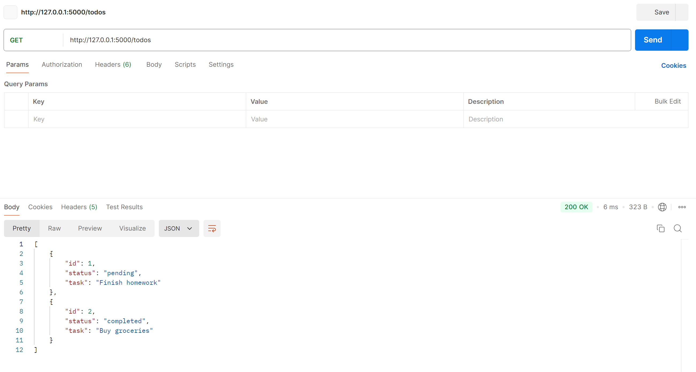
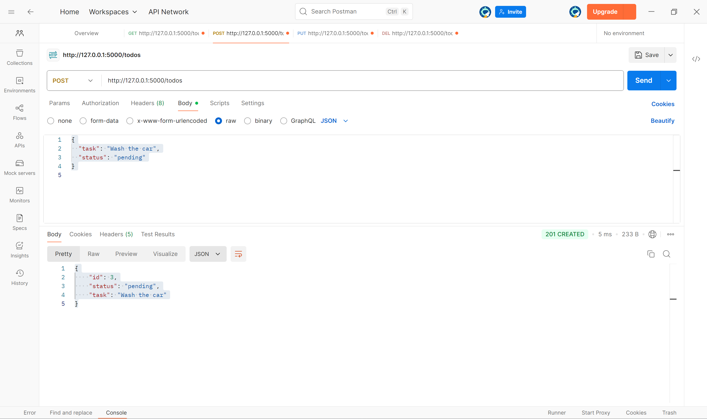
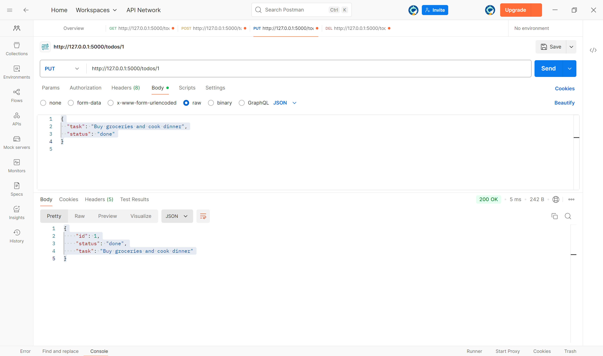
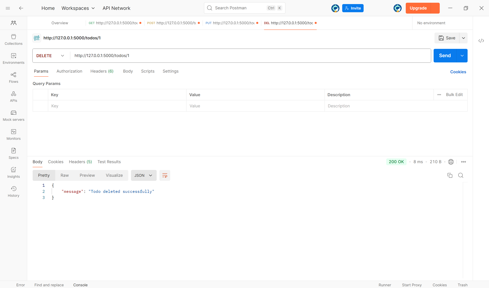
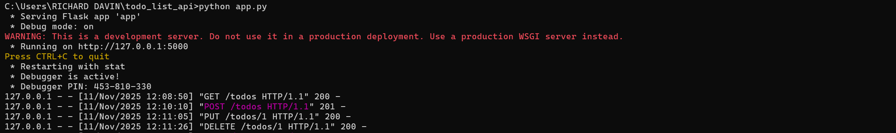

# Todo List API

A simple RESTful API built using **Flask (Python)** that allows users to manage a list of tasks — add, view, update, and delete todo items.  
This project demonstrates fundamental API concepts such as HTTP methods, JSON handling, and CRUD operations.

---

## Project Description

The **Todo List API** is a lightweight backend service that lets users manage their daily tasks efficiently.  
It supports the following operations:
- Adding new todo items  
- Retrieving all existing todos  
- Updating existing tasks  
- Deleting tasks  

The API is built using **Flask**, a micro web framework for Python, and can be tested using **Postman**.

---

## Technologies Used

- **Python 3.x**
- **Flask**
- **Postman** (for testing)
- **Git** & **GitHub** (for version control and publishing)

---

## API Endpoints

| HTTP Method | Endpoint | Description |
|--------------|-----------|-------------|
| **GET** | `/todos` | Retrieve all todo items |
| **POST** | `/todos` | Add a new todo item |
| **PUT** | `/todos/<id>` | Update a todo item by ID |
| **DELETE** | `/todos/<id>` | Delete a todo item by ID |

---

## Setup Instructions (Using Postman)

1. **Start your API server:**
   - Open Command Prompt or VS Code terminal.
   - Navigate to your project directory:
     ```bash
     cd Desktop\todo_list_api

     ```
   - Run the Flask app:
     ```bash
     python app.py
     ```
   - Your server should start at:  
     http://127.0.0.1:5000
     
     

2. **Open Postman** and create new requests for each endpoint:

   - **GET Request**
     - URL: `http://127.0.0.1:5000/todos`
     - Click **Send**
     - You should receive a list of all todos.


   - **POST Request**
     - URL: `http://127.0.0.1:5000/todos`
     - Select **Body → raw → JSON**
     - Example body:
       ```json
       {
         "task": "Wash the car",
         "status": "pending"
       }
       ```
     - Click **Send** → you should see `201 CREATED` and the new todo added.


   - **PUT Request**
     - URL: `http://127.0.0.1:5000/todos/1`
     - Select **Body → raw → JSON**
     - Example body:
       ```json
       {
         "task": "Buy groceries and cook dinner",
         "status": "done"
       }
       ```
     - Click **Send** → you should see `200 OK`.


   - **DELETE Request**
     - URL: `http://127.0.0.1:5000/todos/1`
     - Click **Send** → you should see confirmation of deletion.


---

## Example API Calls (Postman)

- **1. GET – Retrieve all todos**

Request:

Method: GET

URL: http://127.0.0.1:5000/todos

Response:

[
  {
    "id": 1,
    "status": "pending",
    "task": "Finish homework"
  },
  {
    "id": 2,
    "status": "completed",
    "task": "Buy groceries"
  }
]


- **2. POST – Add a new todo**

Request:

Method: POST

URL: http://127.0.0.1:5000/todos

Body (raw JSON):

{
  "task": "Wash the car",
  "status": "pending"
}


Response:

{
  "id": 3,
  "status": "pending",
  "task": "Wash the car"
}

- **3. PUT – Update a todo**

Request:

Method: PUT

URL: http://127.0.0.1:5000/todos/1

Body (raw JSON):

{
  "task": "Buy groceries and cook dinner",
  "status": "done"
}


Response:

{
  "id": 1,
  "status": "done",
  "task": "Buy groceries and cook dinner"
}


- **4. DELETE – Remove a todo**

Request:

Method: DELETE

URL: http://127.0.0.1:5000/todos/1

Response:

{
  "message": "Todo deleted successfully"
}


## Example API Call Log (from Flask Server)
127.0.0.1 - - [11/Nov/2025 12:08:50] "GET /todos HTTP/1.1" 200 -
127.0.0.1 - - [11/Nov/2025 12:10:10] "POST /todos HTTP/1.1" 201 -
127.0.0.1 - - [11/Nov/2025 12:11:05] "PUT /todos/1 HTTP/1.1" 200 -
127.0.0.1 - - [11/Nov/2025 12:11:26] "DELETE /todos/1 HTTP/1.1" 200 -
