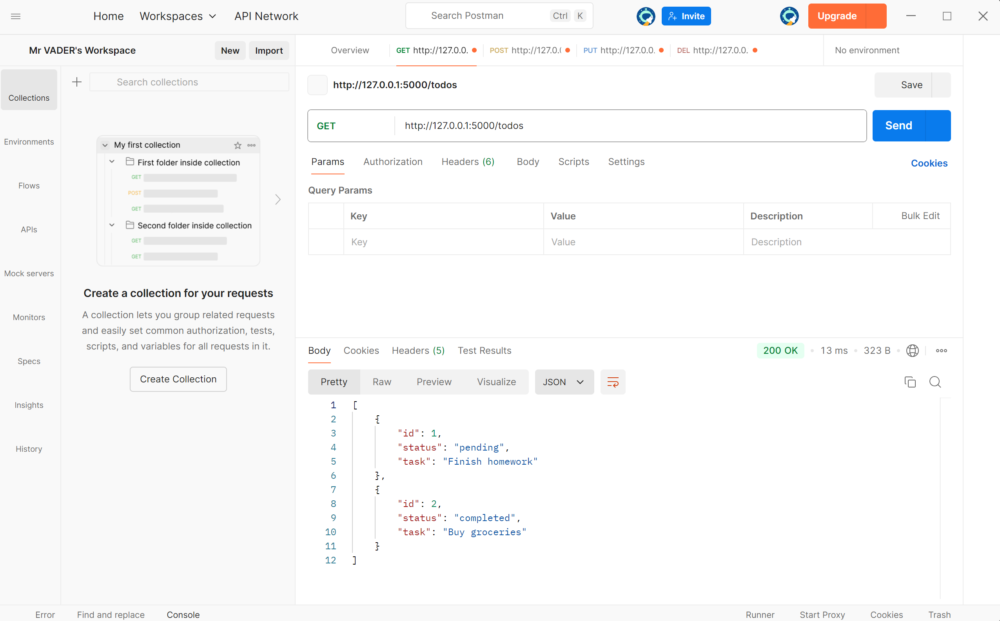
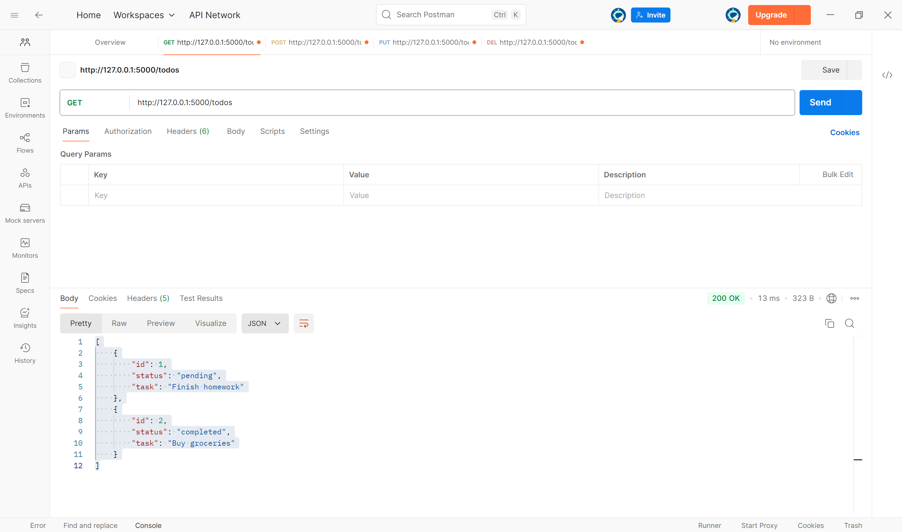
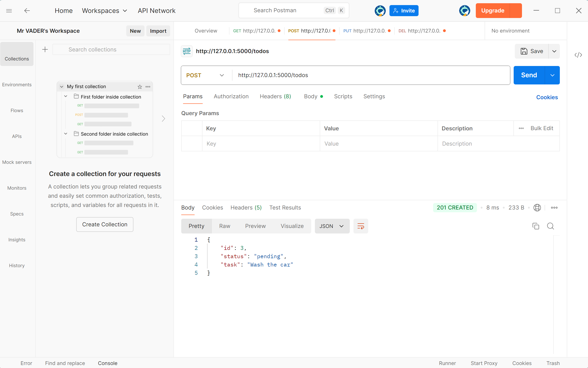
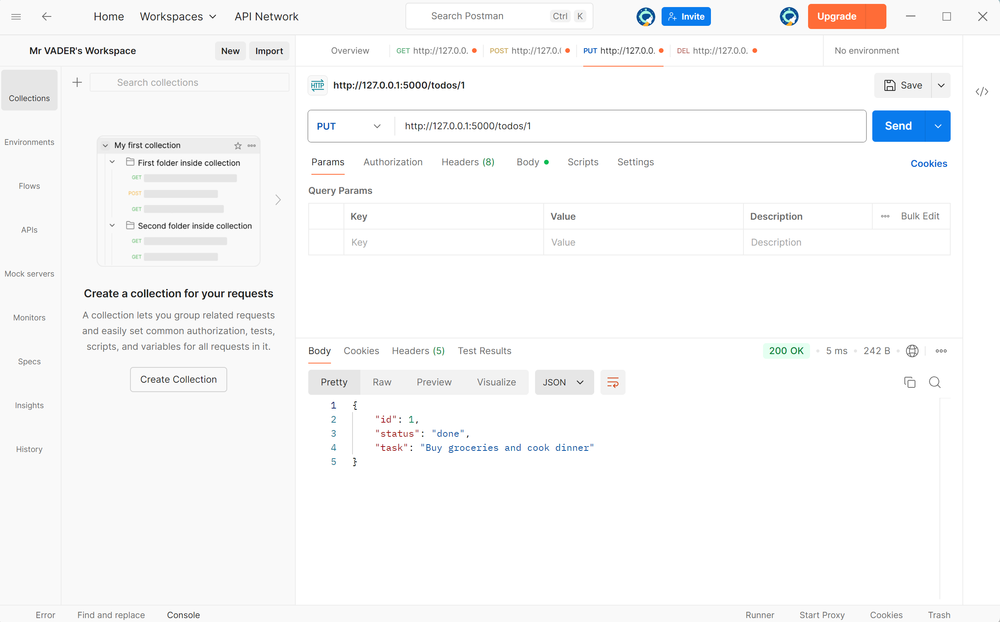
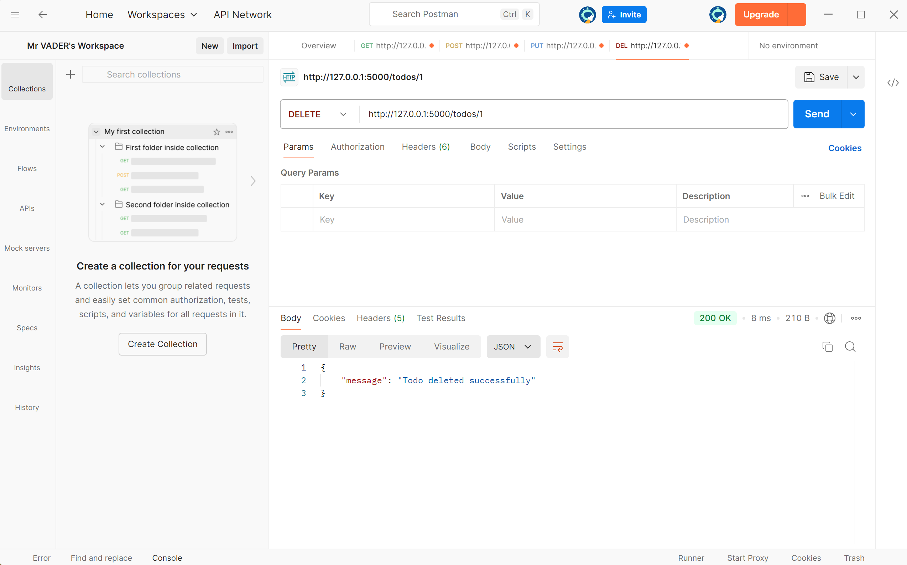

# Todo List API

A simple RESTful API built using **Flask (Python)** that allows users to manage a list of tasks — add, view, update, and delete todo items.  
This project demonstrates fundamental API concepts such as HTTP methods, JSON handling, and CRUD operations.

---

## Project Description

The **Todo List API** is a lightweight backend service that lets users manage their daily tasks efficiently.  
It supports the following operations:
- Adding new todo items  
- Retrieving all existing todos  
- Updating existing tasks  
- Deleting tasks  

The API is built using **Flask**, a micro web framework for Python, and can be tested using **Postman**.

---

## Technologies Used

- **Python 3.x**
- **Flask**
- **Postman** (for testing)
- **Git** & **GitHub** (for version control and publishing)

---

## API Endpoints

| HTTP Method | Endpoint | Description |
|--------------|-----------|-------------|
| **GET** | `/todos` | Retrieve all todo items |
| **POST** | `/todos` | Add a new todo item |
| **PUT** | `/todos/<id>` | Update a todo item by ID |
| **DELETE** | `/todos/<id>` | Delete a todo item by ID |

---

## Setup Instructions (Using Postman)

1. **Start your API server:**
   - Open Command Prompt or VS Code terminal.
   - Navigate to your project directory:
     ```bash
     cd Desktop\todo_list_api

     ```
   - Run the Flask app:
     ```bash
     python app.py
     ```
   - Your server should start at:  
     http://127.0.0.1:5000
     
     

2. **Open Postman** and create new requests for each endpoint:

   - **GET Request**
     - URL: `http://127.0.0.1:5000/todos`
     - Click **Send**
     - You should receive a list of all todos.


   - **POST Request**
     - URL: `http://127.0.0.1:5000/todos`
     - Select **Body → raw → JSON**
     - Example body:
       ```json
       {
         "task": "Wash the car",
         "status": "pending"
       }
       ```
     - Click **Send** → you should see `201 CREATED` and the new todo added.


   - **PUT Request**
     - URL: `http://127.0.0.1:5000/todos/1`
     - Select **Body → raw → JSON**
     - Example body:
       ```json
       {
         "task": "Buy groceries and cook dinner",
         "status": "done"
       }
       ```
     - Click **Send** → you should see `200 OK`.


   - **DELETE Request**
     - URL: `http://127.0.0.1:5000/todos/1`
     - Click **Send** → you should see confirmation of deletion.


---

## Example API Calls

### Using cURL
```bash
# Get all todos
curl http://127.0.0.1:5000/todos


# Add a new todo
curl -X POST http://127.0.0.1:5000/todos \
-H "Content-Type: application/json" \
-d "{\"task\":\"Wash the car\"}"


# Update a todo
curl -X PUT http://127.0.0.1:5000/todos/1 \
-H "Content-Type: application/json" \
-d "{\"task\":\"Buy groceries and cook dinner\", \"status\":\"done\"}"


# Delete a todo
curl -X DELETE http://127.0.0.1:5000/todos/1


